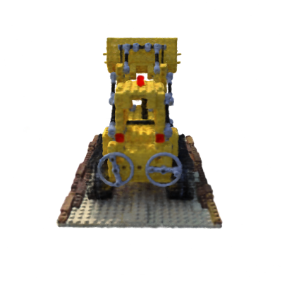
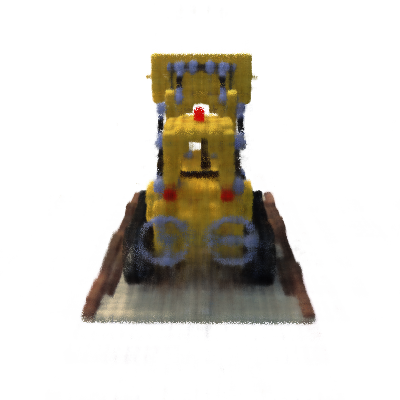

# pure_NeRF
minimal implementation of NeRF

## train a base NeRF

```sh
python main.py --lrate 5e-4 --lrate_decay 500
```

## train a NeRF with multi-resolution hash encoding

```sh
python main.py --hash
```

training hash mode for 10 minutes:
<p float="center">
  
</p>

training vanilla nerf for 10 minutes:
<p float="center">
  
</p>

converging speed:
Hash
<p float="center">
  
</p>

vanilla
<p float="center">
  
</p>
